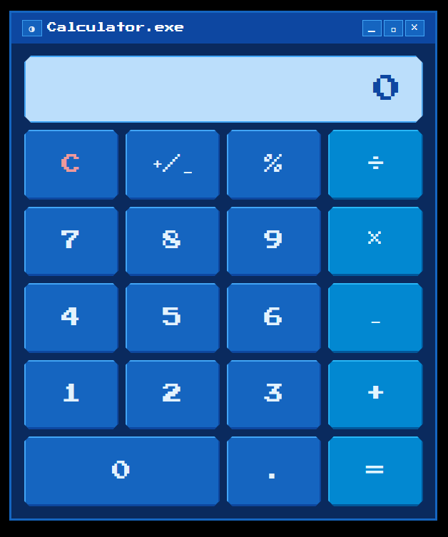
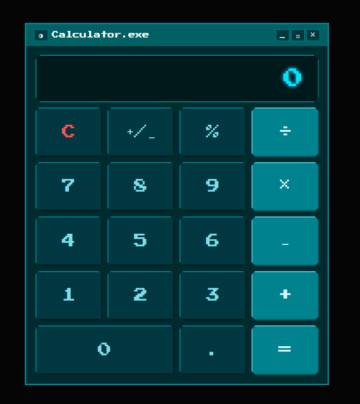

# Calculadora

Calculadora interactiva construida con React, TypeScript y Vite. Incluye soporte para temas, Storybook y pruebas unitarias.

## Capturas de pantalla




## Correr el proyecto

### Con Docker Compose

```bash
docker compose up
```

Levanta dos servicios:
- **App** → [http://localhost:5173](http://localhost:5173)
- **Storybook** → [http://localhost:6006](http://localhost:6006)

### Sin Docker

```bash
yarn install
yarn dev        # App en http://localhost:5173
yarn storybook  # Storybook en http://localhost:6006
```

---

## Comandos disponibles

| Comando | Descripción |
|---|---|
| `yarn dev` | Inicia el servidor de desarrollo |
| `yarn build` | Genera el build de producción |
| `yarn test` | Ejecuta las pruebas unitarias con Vitest |
| `yarn lint` | Analiza el código con ESLint |
| `yarn storybook` | Abre Storybook en el puerto 6006 |

---

## Características implementadas
- **Typescript** uso de typescript para el desarrollo de la calculadora
- **Package manager** uso de yarn como package manager, lockfile: yarn.lock en raiz
- **Operaciones básicas**: suma, resta, multiplicación y división
- **módulo**: operador `%` (mod)
- **Decimales**: soporte para entrada y resultados con punto decimal
- **Toggle +/−**: cambia el signo del número actual
- **Límite de caracteres**: máximo 9 caracteres en pantalla; excederlo provoca blink sin cambiar el valor
- **Manejo de errores**: división por cero, desbordamiento o valores no finitos muestran `ERROR`
- **Operaciones encadenadas**: se puede encadenar múltiples operaciones sin pulsar `=`
- **Hook** uso de hook para manejo de logica
- **Title y Favicon** Cambio en el title y favicon default
- **Temas**: contexto de tema con `ThemeProvider` y hook `useTheme`; estilos intercambiables vía CSS
- **Linter y Prettier** sin errores
- **Storybook**: historias para `Button`, `Display` y `Calculator`
- **Pruebas unitarias**: cobertura sobre entrada de dígitos, toggle, errores, decimales y operaciones encadenadas

## Estructura del proyecto

```
src/
├── calculator/
│   └── calculatorReducer.ts      # Lógica de la calculadora
├── components/
│   ├── Button/
│   │   ├── Button.tsx
│   │   ├── Button.css
│   │   └── Button.stories.tsx
│   ├── Display/
│   │   ├── Display.tsx
│   │   ├── Display.css
│   │   └── Display.stories.tsx
│   └── Calculator/
│       ├── Calculator.tsx
│       ├── Calculator.css
│       └── Calculator.stories.tsx
├── hooks/
│   └── useCalculator.ts          # Hook que conecta el reducer con React
├── Theme/
│   ├── theme.context.ts
│   ├── ThemeProvider.tsx
│   ├── useTheme.ts
│   └── Themes.css
├── types/
│   ├── calculadora.ts
│   └── theme.ts
├── test/
│   ├── helpers.ts
│   ├── input.test.ts
│   ├── toggle.test.ts
│   ├── errors.test.ts
│   ├── division-decimals.test.ts
│   └── chained-operations.test.ts
├── App.tsx
└── main.tsx
```

---
